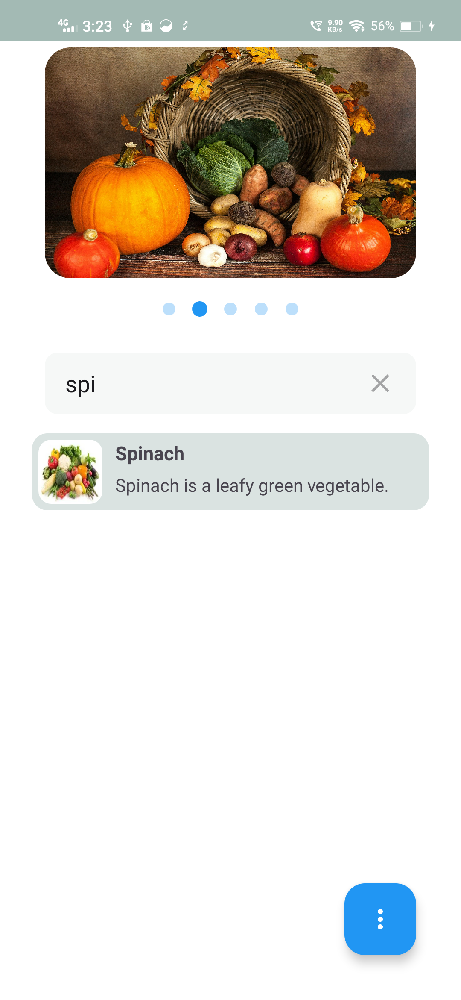
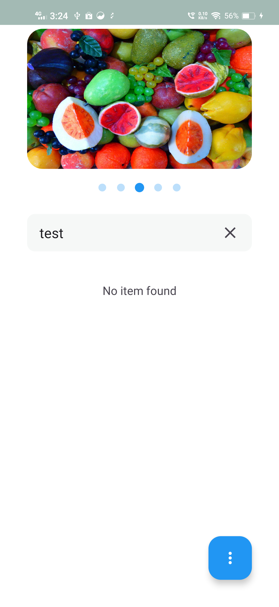

# Catalog App

Welcome to the Catalog App! This application provides a comprehensive overview of various categories, including animals, vegetables, fruits, bikes, and cars. It is designed to offer detailed information and a user-friendly experience for browsing through these categories.

## Features

1. **Top Carousel**
  - Displays the current catalog type (e.g., animals, vegetables, fruits, bikes, cars).
  - Changing the carousel updates the list items and catalog type.

2. **Search Functionality**
  - Allows users to search within the catalog range.
  - The search box floats and remains accessible when the user scrolls upward, and the top carousel collapses.

3. **Catalog Analysis**
  - Users can view the current analysis of a catalog.
  - Analysis includes:
    - Catalog range count.
    - Maximum three-character occurrence value.

## Usage

### Carousel Navigation
- Scroll through the top carousel to select a different catalog type.
- The list items will update according to the selected catalog.

### Searching the Catalog
- Use the search box to find specific items within the catalog range.
- The search box will float at the top of the screen when scrolling through the catalog list.

### Viewing Catalog Analysis
- Select the option to view the current analysis of the catalog.
- The analysis will display the count of items in the catalog range and the maximum occurrence of three-character sequences within the catalog items.

## Libraries Used

This application uses several libraries to provide a robust and efficient development experience. Below is a list of the libraries used in the Catalog App:

- **AndroidX Libraries:**
    - `androidx.core:core-ktx` - Provides Kotlin extensions for core Android components.
    - `androidx.appcompat:appcompat` - Adds support for modern Android features on older devices.
    - `androidx.activity:activity-ktx` - Provides Kotlin extensions for activity-related functions.
    - `androidx.constraintlayout:constraintlayout` - Used for flexible and efficient layouts by following a flat hierarchy.
    - `androidx.lifecycle:lifecycle-runtime-ktx` - Provides Kotlin extensions for lifecycle-aware components.
    - `androidx.fragment:fragment-ktx` - Offers Kotlin extensions for Fragment operations.

- **Material Design:**
    - `com.google.android.material:material` - Implements Material Design components and themes.

- **Dependency Injection:**
    - `dagger.hilt.android:hilt-android` - Simplifies dependency injection in Android applications.
    - `dagger.hilt.compiler:hilt-android-compiler` - Annotation processor for Hilt.
    - `androidx.hilt:hilt-compiler` - Hilt compiler for AndroidX integration.

These libraries enhance the functionality and maintainability of the Catalog App, making development more efficient and the app more reliable.

## Screenshots

---

Thank you for using the Catalog App !!!
